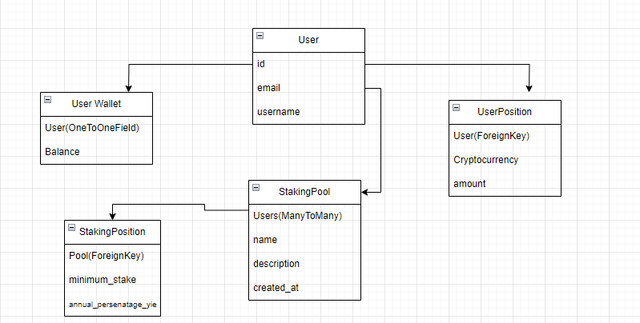

# Crypto Staking Platform 
This API allows an authorized user to create a wallet with a certain balance of cryptocurrency on it. In addition, the user can create Positions from various cryptocurrencies, provided that their amount does not exceed the total balance. Different users can create Stack Pools to which the administrator can add other users. There is also an endpoint describing the conditions of the pools.
## DB Structure 

### Main rules:
- Authorized user can create only one wallet only for himself
- User can update only his own wallet
- Authorized user and admin can create UserPositions, StakingPools and PoolConditions
- Only authorized user can read information from this API
- Admin can create and update everything

## Technologies used
- Django
- Django Rest Framework
- JWT authentication
- Pytest
- Drf-spectacular

## Installation
1. Clone the repository:
   ```shell
   git clone https://github.com/KirillMelanich/Kyrylo_Melanich_Test_Task_for_Inspector_Development.git
   
2. Navigate to the project directory and activate virtual environment:
   ```shell
   cd crypto_staking_platform
   python -m venv venv
   venv\Scripts\activate (on Windows)
   source venv/bin/activate (on macOS)
3. Install dependencies
    ```shell
    pip install -r requirements.txt
    ```
4. Use `.env_sample` file as a template and create `.env` file with your settings

5. Run python manage.py runserver
```
Use credentials for login:
  - email: admin@admin.com
  - password: 1234
```

6. For Docker usage run:
```
   docker-compose up
```